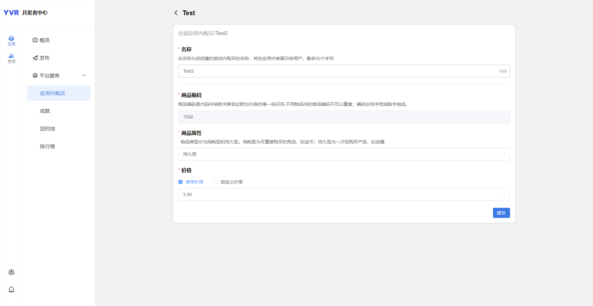
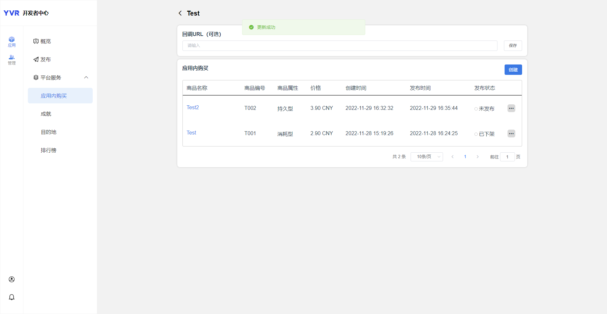

# 应用内购

> [!Important]
> 在使用任何平台功能之前，开发者首先需要初始化 Platform SDK。更多详情，请参考 [Platform](./Platform.md)。

YVR 支付是一个基于 YVR 账户系统的当前支付系统。支付结算由 YVR 的游戏货币（Y币）完成。用户需要进入 YVR 用户中心为其账户充值。


## 添加商品

1. 登入[开发者中心](https://developer.yvr.cn/yvrdev/all_apps)。

2. 点击已创建应用，选择 **应用 > 平台服务 > 应用内购买**，点击创建。

3. 填入商品信息：

    - **名称**：向用户显示的商品名称。

    - **商品编码**：每个商品的独特编码。 

    - **商品属性**：消耗型或持久型。

    - **价格**：推荐或自定义。

    

4. 点击提交。

    

- 发布状态：未发布 / 已发布 / 已下架


## 接口信息

### 登入

在进行支付之前，请检查用户的登入状态。

```csharp
YVR.Platform.LoginPay.Initialize(<appID>);

if (LoginPay.IsYVRUserLogin)
    Debug.Log("User has logged in.");
else
    Debug.LogError("User has not logged in!");

```

### 付款

`YVR.Platform.PayResponse`： 获取付款详情

### 订单

`YVR.Platform.OrderListResponse`： 获取订单详情，如SKU、价格、数量等。