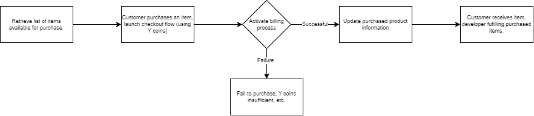
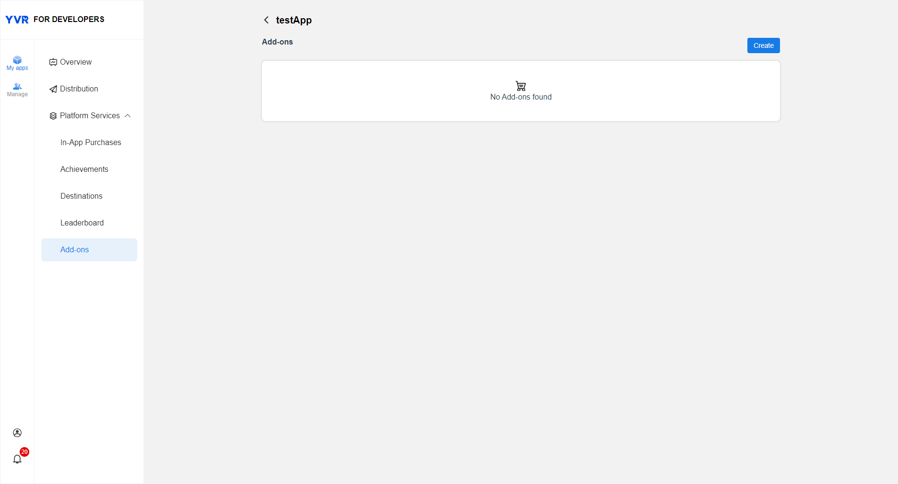
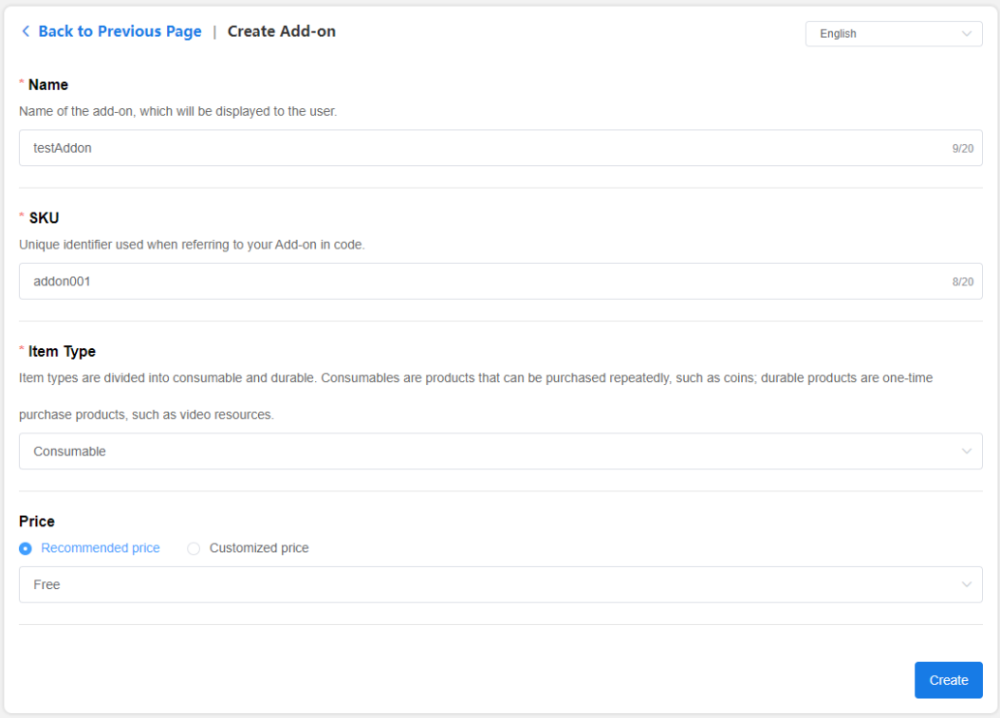
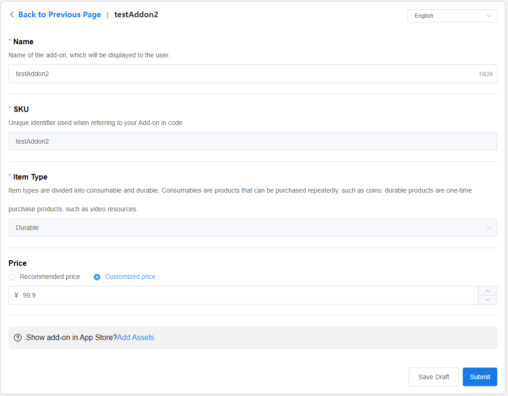
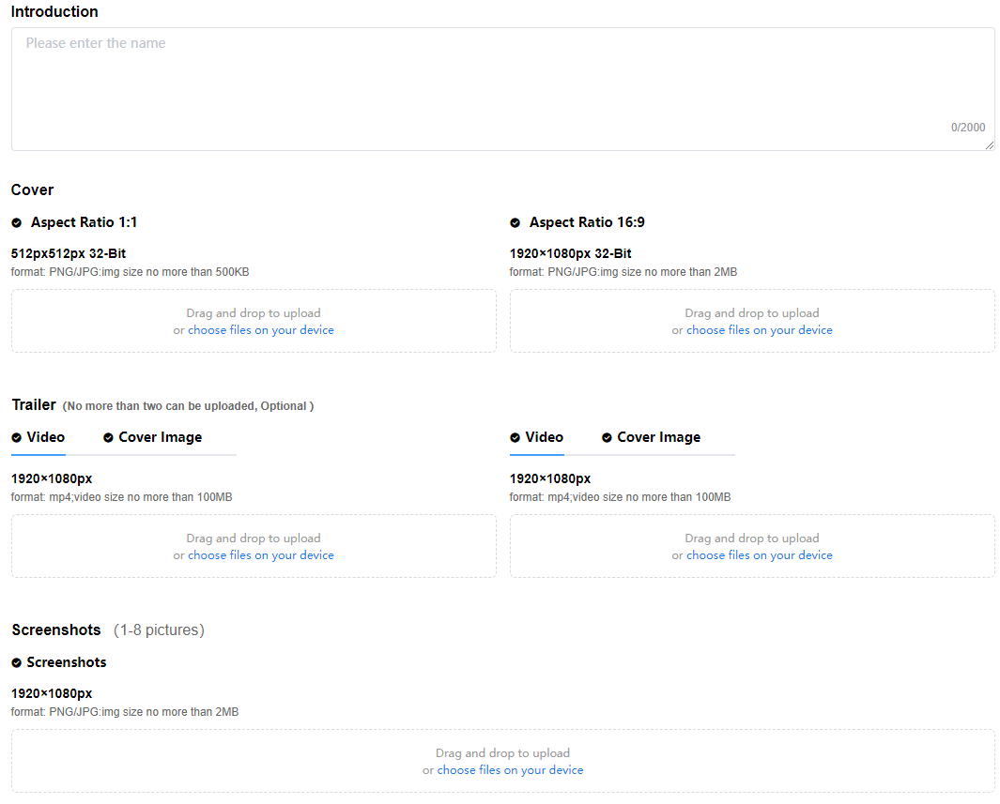

# In-App Purchase Client API

> [!Important]
> Before using any platform features, developers have to initialize Platform SDK first. Refer to [Platform](./Platform.md) for more information.

YVR Payment is a current payment system based on YVR account system. The payment settlement is done by YVR's game currency (Y coin). Users will need to enter YVR user centre to top-up their account.

> [!Note] 
> For Mainland China, if the app is categorized as "Game" and did not obtain version no., IAP service cannot be used in the app. For non-Mainland regions, IAP service is available to all.

> [!Note]
> The IAP service supported in versions prior to Unity SDK 2.3.0 has been deprecated, please migrate to the new version as soon as possible. For more information, refer to [In-App Purchase](./Payment.md).

## Payment process

| **Name** | **Description** |
| ------- | -------- |
| Add-on | Additional content, which can be sold both in-app and on the YVR App Store, the former of which can be referred to as in-app purchases. |
| In-App Purchase (IAP) | In-game purchases of game props, virtual currency, or other value-added services. The object of the purchase is add-on content. |
| Consume | The process of fulfillment after the purchase of a consumable good. For example, when a user purchases 100 coins and successfully top-ups his account, we will consider the fulfillment as "complete". After the fulfillment of the consumable item, the user can purchase the item again. |
| SKU | Product (Item) ID, unique identifier of the add-on. |
| DLC | DLC (Downloadable Content) ）refers to downloadable add-on contents, in-game extensions, add-on items, or supplemental packs, that are added to a game via download. DLC and add-on contents are both associated. |

## Add Product

1. Login to [Management Center](https://developer.yvr.cn/yvrdev/all_apps). 

2. Click on the app that you have created, select **My apps > Platform Services > Add-ons**.  

    

3. Click Create, Create Add-on window is displayed. 

    - **Name**: Product name that is displayed to the users.

    - **SKU**: Unique ID of each product. 

    - **Item Type**: Consumable or durable.

    - **Price**: Recommended or custom. 

    

4. Click Create. Add-on list will show all the created add-ons, the status will display as published or unpublished.

5. Under Add-on list, select add-on title or click Edit to modify the add-on information. 
    
    

6. Edit add-on information to modify name and price. 

7. Durable items can be published and sold on YVR store. Click to add store assets.

    

8. Click Submit. After submission, add-on will undergo review process. Upon successful review, you could publish or unpublish the add-ons. Only published add-ons can be viewed or purchased by users.

## Edit Add-on Information

Once the add-on content has been approved, if you need to edit the information or status, do the following steps:

1. Select the Add-on and enter the Edit page.

2. Modify the information.

3. Click Submit. The initial add-on content will remain in effect until the new submission is approved and updated in store.

## API Information

| **API** | **Description** | 
| :------ | :-------------- |
| GetProductsBySku | Get a list of items available for purchase. |
| LaunchCheckoutFlow | Initiate the purchase process, requires to use GetProductsBySKU API before acquiring the information. |
| GetViewerPurchases | Get a list of purchased products. After completing the purchase process, call the GetViewerPurchases API to show the user a list of purchased items, including permanent items and consumable items that have not yet been fulfilled. |
| ConsumePurchase | Fulfilling purchased items. For consumable items, need to implement fulfilment logic in the app. For example, if you add a "10 coins" product, after the user purchases the item, the backend must recharge the specified user's account with 10 coins. You can call the ConsumePurchase API to record the fulfilment result. After fulfilment, the GetViewerPurchases interface will not return the item. The user cannot re-purchase the same consumable until the previous order has been completed. |

### IAP Product：
`YVR.Platform.IAPProduct` provides product information, includes the following properties:

| **IAPProduct** | **Type** | **Description** |
|:-------------- | :------- | :-------------- |
| appID | long | App ID of which product belongs to |
| sku | string | Product ID |
| name | string | Product name |
| description | string | Product description |
| icon | string | Product icon URL |
| addOnType | int | Product type: consumable or non-consumable |
| price | float | Product price |

### Order Product
`YVR.Platform.IAPPurchasedProduct` provides the purchased product information. 
`YVR.Platform.IAPPurchasedProductList` provides the purchased product data list. 

A purchased product contains the following properties: 

| **IAPPurchasedProduct** | **Type** | **Description** |
|:----------------------- | :------- | :-------------- |
| id | string | Order ID |
| sku | string | Product ID |
| name | string | Product name |
| icon | string | Product icon URL |
| addOnType | int | Product type: consumable or non-consumable |

## Debug API

> [!Important] 
> The platform service status needs to be **Published** when calling the IAP related APIs.

1. When the app has not yet been submitted (draft), developer creates platform services in the Management Center, the developer can use the App ID and API Name to invoke the platform services.
2. When the app is updated and the developer creates a new platform service in the Management Center, the developer can use the App ID and API Name to invoke the platform service in the new version without affecting the online version.
 

**Note**: When the app is uploaded and the platform service is published (Add-on content in app store is turned on), the add-on content will be displayed and sold in the store. You will need to turn off Add-on content in app store during the debugging phase.

> [!NOTE]
> For more information, please refer to [IAP API Documentation](xref:YVR.Platform.IAP).
