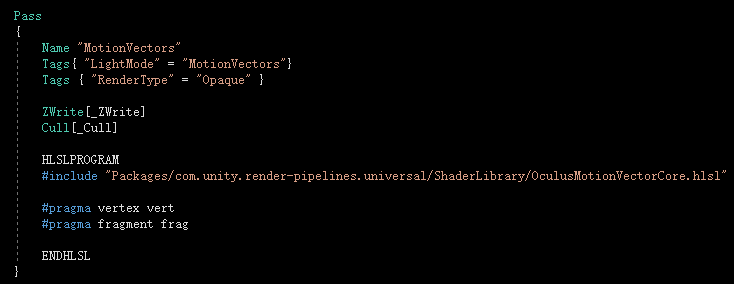
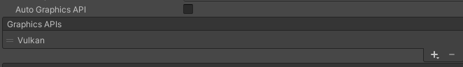
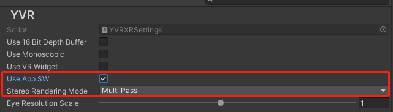
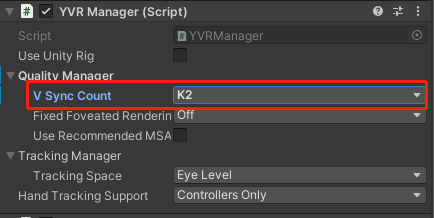

# 应用空间扭曲

应用空间扭曲（AppSW）是一种面向开发者的优化技术，允许应用以实际显示刷新率的一半进行渲染，从而为合适的内容释放额外的计算能力。据测试使用，AppSW 最高可为应用提供了70%的额外算力，而且几乎没有可感知的瑕疵。开发者在开发和设计阶段开启 AppSW 功能后，系统会基于应用内原始数据的运动矢量和深度信息进行帧外推和重投影，将一帧原始渲染图像自动合成多个新帧，以降低设备原始输出帧率、降低设备负载和功耗，最终突破算力限制，在 YVR 设备上实现接近 PCVR 更逼真、更优秀的画面表现。


## 环境要求

- 设备版本： YVR1 或 YVR2

- SDK 版本： 2.4.0 及以上

- 系统版本 1.2.5.x 


## 开启 AppSW

请参考以下步骤启用 AppSW 功能。

1. 克隆 [Unity-Graphics](https://github.com/YVRDeveloper/Unity-Graphics) 仓库。在项目中导入以下三个 package.json 文件。从上方菜单栏处，选择 **Window** > **Pacakge Manager** > **Add package from disk...** 并安装以下软件包：
    - Core RP Library 
    - Shader Graph
    - Universal RP
    <br />
        


2. 如果使用自定义 shader，则需要在 AppSW 物体 Shader 中添加 `Motion Vector Pass`。

    

    > [!Note] 
    > - 如果使用 URP Lit 或 SimpleLit，则无需修改 Shader。
    > - 只有不透明的物体需要添加此 `Motion Vector Pass`，透明物体无需添加。
    > - 接近于不透明的物体(如 Alpha 接近于1)，也可以根据情况添加。

3. 从上方菜单栏处，选择 **Edit** > **Project Settings**。在左侧栏，选择 **Player** > **Android settings** > **Other Settings**。在 **Rendering** 部分，将 **Vulkan** 添加至 **Graphics APIs**。
    <br />
    

4. 从上方菜单栏处，选择 **Edit** > **Project Settings**。 在左侧栏，选择 **XR Plug-in Management** > **YVR**，完成以下设置：
    <br />
    - 勾选 **Use AppSW**
    - 在 **Stereo Rendering Mode** 里，选择 **Multiview**
    <br />
    

5. 输入以下代码启用 AppSW。

    ```
    YVRManager.instance.SetAppSWEnable(true);
    ```

6. 假设你应用的当前帧率为90帧，开启AppSW功能时，应用会以45帧渲染画面，但仍可以达到90帧的效果。若需要对比`开启 AppSW + 45帧`和`关闭 AppSW + 45帧`渲染的效果：在 **YVR Manager** 下，选择 **Quality Manager** > **V Sync Count: K2** 进行对比。
    <br />
    


## 已知问题

在使用 AppSW 功能时，你的应用可能会出现一些渲染问题。请参考以下场景和说明来解决问题：

- 若场景内的背景十分简洁，并且包含直线、网格等元素，AppSW 可能会导致图像失真，例如：直线扭曲。若出现图像失真情况，可不断进行调试并调整背景，直到达到满意的效果。 
<br /><br />

- 若场景内包含一些高速旋转的物体，开启 AppSW 后，物体周围可能会出现失真伪影，可通过降低物体的旋转速度来解决该问题。
<br /><br />

- 若场景中个别元素有意外停顿或画面上有波纹，这一般是因为运动矢量的数据不够准确，具体原因为：

   - 如果运动矢量缓冲区没有显示场景中移动部分的运动，就会造成停顿，因为移动的物体在合成帧中似乎保持在原地。

   - 如果运动矢量缓冲区显示场景中不动的部分有运动，就会产生波纹，因为静止的物体在合成帧中会发生移动。