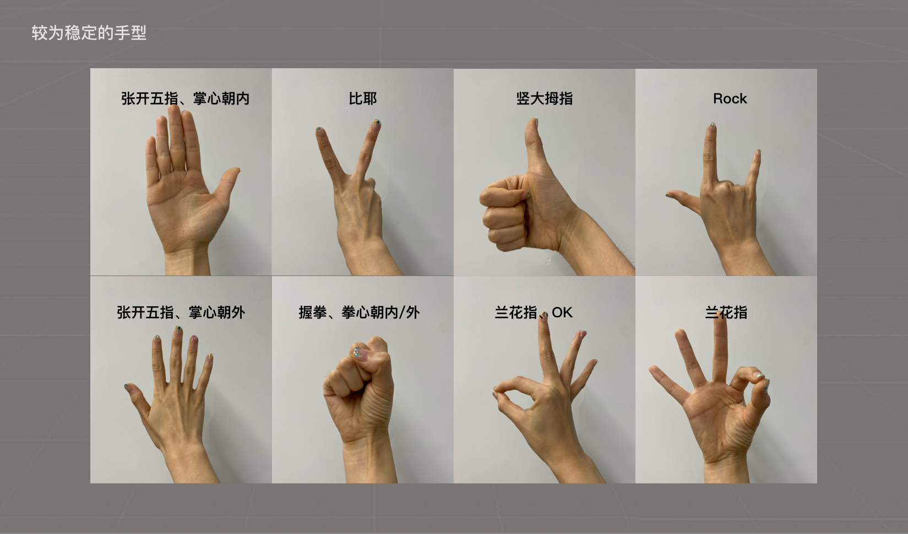
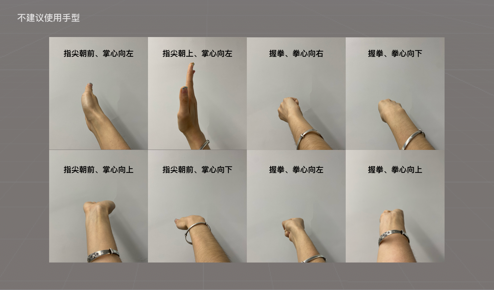
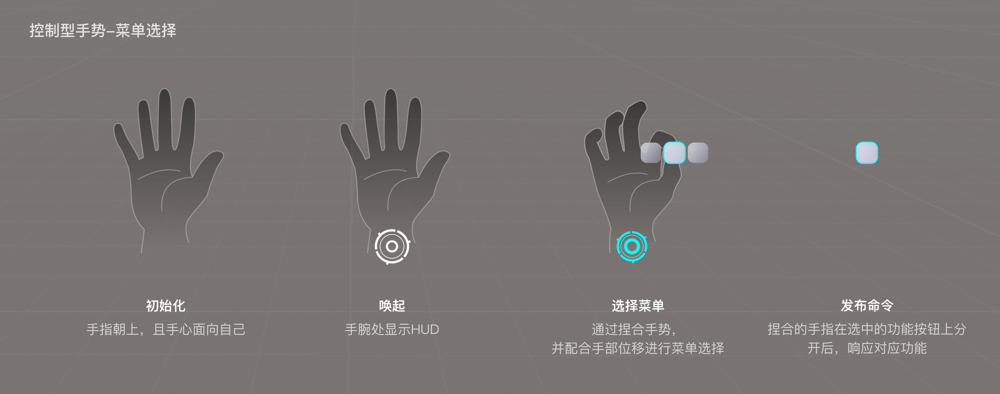

# 第三方手势识别限制

本文档对手势识别中手型应用的边界做一些约束，避免一些常见的识别错误。共分为三部分进行说明：

- 第一部分：静态手型，针对静态手型进行说明，其中包含建议使用的手型和不建议使用的手型；
- 第二部分：动态手势，针对手型进行不同类型的运动的边界说明；
- 第三部分：YVR的控制型手势，建议第三方应用避开使用手势，以免在应用运行过程中被误触发。

## 静态手型

建议使用用户可以自然的、舒适的完成的手型，更加符合人体工程学，同时在手势的识别层面建议使用：

- 手部**可视特征较多**的手型，即可以看到更多手部特征的手型
- 更建议使用**右手**
- 下图仅为部分示意图
       
    

 
各种扭曲的、别扭的、反人类的手势并不推荐，同时在算法层面不建议使用：

- 手部**可视特征较少**的手型，即无法看到更多手部特征的手型
- 不建议使用**双手交叠**的手型，如双手交叉等
- 下图仅为部分示意图，类似的**手型（左/右）均不建议使用**
      
    

## 动态手势

动态手势可以理解为是：静态手形+时间维持判断。因此结合静态手型的使用建议，不建议快速运动的手势：

- 快速的**挥动**各种手型，如快速挥动手掌、拳头等
- 快速的**转动**各种手型，如快速转动手腕等
- 快速执行**动态手势**，如快速握拳、快速捏合等
- 快速**移动**各种手型，如快速朝各个方向移动各种手型

## 控制型手势

以下为YVR的控制型系统手势，建议第三方应用中避免使用该手势进行游戏交互，以免误触发唤起系统菜单。当前版本已上线控制型手势如下：

- 初始化：手心面向自己，指尖向上
- 唤起：当手腕处且出现系统图标，即为唤起成功
- 选择菜单：通过捏合手势，并配合手部位移进行菜单选择
- 发布命令：悬停在按钮，分开食指和拇指，二级菜单渐隐，仅显示该功能按钮（闪烁一定时间后消失）并响应其对应功能

