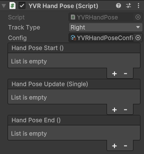

# YVR Hand Pose

YVR 手势脚本用于选择被追踪的手（Track Type）、添加通过手势生成创建的手势配置文件（Config）、创建手势事件。 

追踪目标（Track Type）参数用于设置手势配置所运用的手，包括：
- Any（任意）：任意一只手，即以设备检测到的手为准
- Left（左）: 左手
- Right（右）：右手

手势配置文件（Config）用于存放手势生成脚本生成的手势配置文件。

手势事件类型： 
- Start（开始）： 事件在手势开始时触发。
- Update（更新）: 事件在手势持续的每一帧触发，并返回手势已经持续的时间（毫秒）。
- End（结束）：事件在手势结束时触发。
     
    