# 示例

基于使用手势生成和手势事件触发，以下章节将演示相关的创建步骤。这里列出了几种手势，如 Thumb-up 与 Ok 等手势。 Thumb-up 是拇指向上的形态，其他手指呈弯曲和卷曲状。Ok 手势是拇指和食指弯曲并捏住指尖。中指、无名指和小指没有完全伸直或张开。请参考以下的手势示例：

- Thumb-up 
- Ok 
- Rock 
- Gun 
- Love 
- Peace
- Fist 

## 导入 YVR SDK

1. 下载最新版本的 [YVR Unity SDK](https://developer.yvr.cn/#/)。

    > [!Important]
    > SDK 必须为 2.4.x 及以上版本。

2. 解压所下载的 SDK 压缩包。

3. 打开将要使用的项目。

4. 在上方菜单栏处，选择 **Windows** > **Package Manager**。

5. 在 **Pacakge Manager** 窗口中，选择 **+** > **Add package from disk...**。

    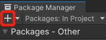

6. 输入 SDK 的路径，并按此顺序导入 package.json 文件：`Utilities` > `Core` > `Interaction Toolkit`。

7. 导入 SDK 后，将显示 YVR SDK 设置窗口。

8. 在 **Pacakge Manager** 窗口中，选择 **Packages: In Project** > **YVR Interaction Toolkit** > **Samples**，选择 **Import** 导入手势交互示例（Hands Interaction Demo）。

    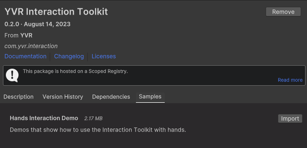

## 创建手势

### 创建 Thumb-up 手势

1. 在项目中，选择 `Create Empty`，在 Hierarchy 面板下添加一个新的游戏对象，并将其重命名为 **ThumbUpPose**。

2. 在 Inspector 面板下，选择 `Add Component` 添加 **YVR Hand Pose** (YVRHandPose.cs) 和 **YVR Hand Pose Generator** (YVRHandPoseGenerator.cs) 脚本。

3. 在 **YVR Hand Pose Generator** 下，选择 **New** 创建一个新的手部姿势配置文件。将其命名为 “**ThumbUp**”。

4. 在 **Shapes Recognizer**，手指的设置如下：
     
    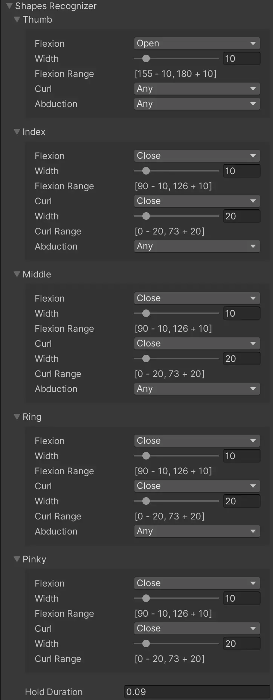

5. 在 **Transform Recognizer**，手的设置如下：
     
    

6. 使用 **YVR Hand Pose** 脚本设置手势事件。选择 **Track Type** 和 **Config**。添加 **Hand Pose Start**，**Hand Pose Update** 和 **Hand Pose End** 事件触发的函数。 

7. 保存项目。 

### 创建 Ok 手势

1. 在项目中，选择 `Create Empty`，在 Hierarchy 面板下添加一个新的游戏对象，并将其重命名为 **OkPose**。

2. 在 Inspector 面板下，选择 `Add Component` 添加 **YVR Hand Pose** (YVRHandPose.cs) 和 **YVR Hand Pose Generator** (YVRHandPoseGenerator.cs) 脚本。

3. 在 **YVR Hand Pose Generator**下，选择 **New** 创建一个新的手部姿势配置文件。将其命名为 “**Ok**”。

4. 在 **Shapes Recognizer**，手指的设置如下： 
     
    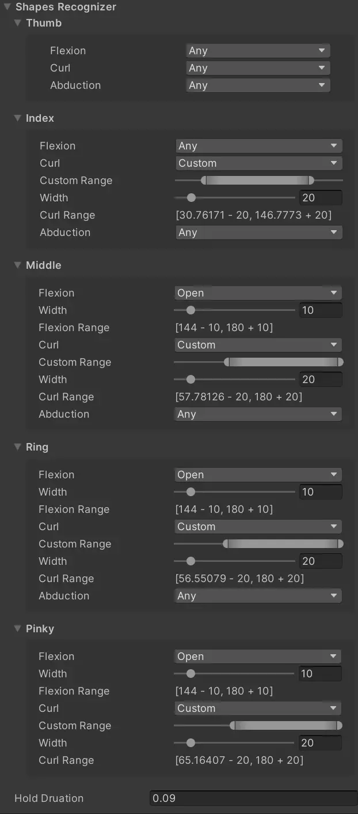

5. 在 **Bones Recognizer**，手指的设置如下： 
     
    

6. 在 **Transform Recognizer**，手的设置如下：
     
    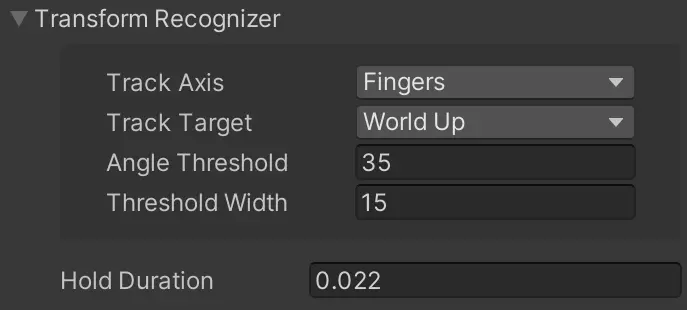

7. 使用 **YVR Hand Pose** 脚本设置手势事件。选择 **Track Type** 和 **Config**。添加 **Hand Pose Start**，**Hand Pose Update** 和 **Hand Pose End** 事件触发的函数。 

8. 保存项目。

### 创建 Rock 手势

1. 在项目中，选择 `Create Empty`，在 Hierarchy 面板下添加一个新的游戏对象，并将其重命名为 **RockPose**。

2. 在 Inspector 面板下，选择 `Add Component` 添加 **YVR Hand Pose** (YVRHandPose.cs) 和 **YVR Hand Pose Generator** (YVRHandPoseGenerator.cs) 脚本。

3. 在 **YVR Hand Pose Generator** 下，选择 **New** 创建一个新的手部姿势配置文件。将其命名为 “**Rock**”。

4. 在 **Shapes Recognizer**，手指的设置如下：
     
    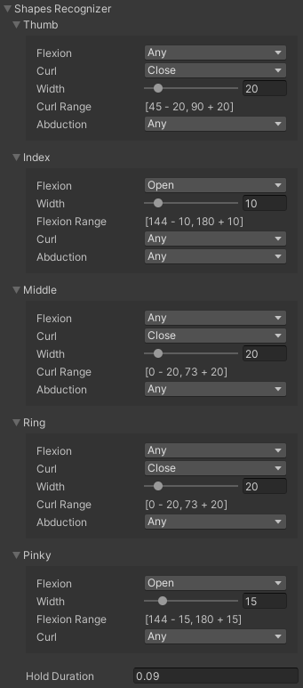

5. 在 **Transform Recognizer**，手的设置如下：
     
    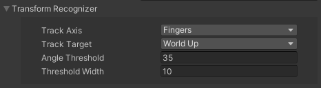

6. 使用 **YVR Hand Pose** 脚本设置手势事件。选择 **Track Type** 和 **Config**。添加 **Hand Pose Start**，**Hand Pose Update** 和 **Hand Pose End** 事件触发的函数。 

7. 保存项目。 

### 创建 Gun 手势

1. 在项目中，选择 `Create Empty`，在 Hierarchy 面板下添加一个新的游戏对象，并将其重命名为 **GunPose**。

2. 在 Inspector 面板下，选择 `Add Component` 添加 **YVR Hand Pose** (YVRHandPose.cs) 和 **YVR Hand Pose Generator** (YVRHandPoseGenerator.cs) 脚本。

3. 在 **YVR Hand Pose Generator** 下，选择 **New** 创建一个新的手部姿势配置文件。将其命名为 “**Gun**”。

4. 在 **Shapes Recognizer**，手指的设置如下：
     
    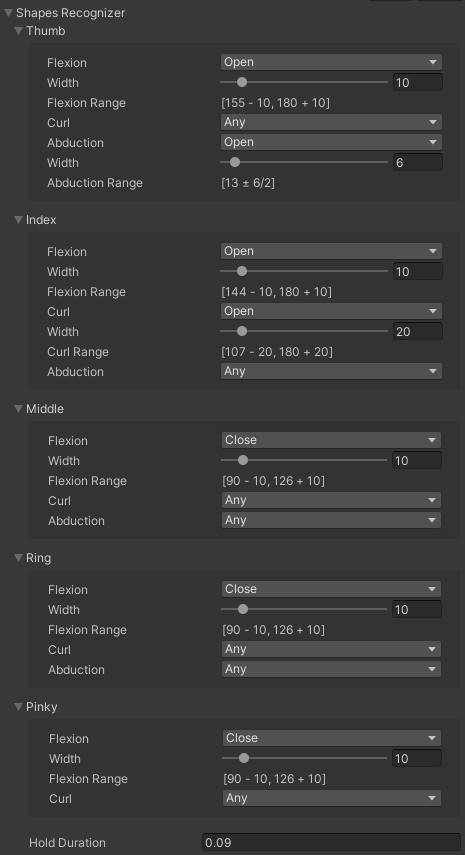

5. 在 **Transform Recognizer**，手的设置如下：
     
    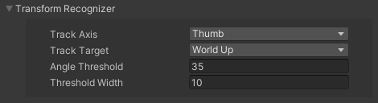

6. 使用 **YVR Hand Pose** 脚本设置手势事件。选择 **Track Type** 和 **Config**。添加 **Hand Pose Start**，**Hand Pose Update** 和 **Hand Pose End** 事件触发的函数。 

7. 保存项目。 

### 创建 Love 手势

1. 在项目中，选择 `Create Empty`，在 Hierarchy 面板下添加一个新的游戏对象，并将其重命名为 **LovePose**。

2. 在 Inspector 面板下，选择 `Add Component` 添加 **YVR Hand Pose** (YVRHandPose.cs) 和 **YVR Hand Pose Generator** (YVRHandPoseGenerator.cs) 脚本。

3. 在 **YVR Hand Pose Generator** 下，选择 **New** 创建一个新的手部姿势配置文件。将其命名为 “**Love**”。

4. 在 **Shapes Recognizer**，手指的设置如下：
     
    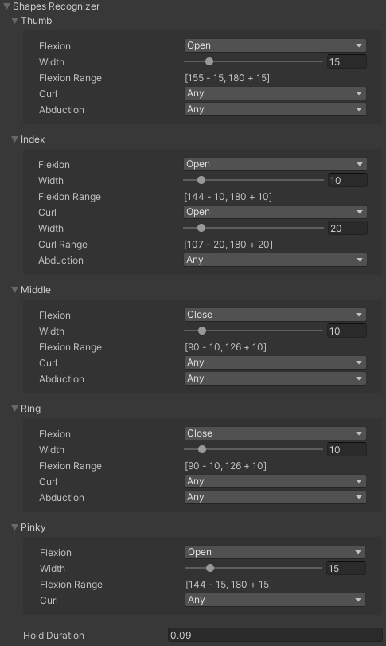

5. 在 **Transform Recognizer**，手的设置如下：
     
    

6. 使用 **YVR Hand Pose** 脚本设置手势事件。选择 **Track Type** 和 **Config**。添加 **Hand Pose Start**，**Hand Pose Update** 和 **Hand Pose End** 事件触发的函数。 

7. 保存项目。 

### 创建 Peace 手势

1. 在项目中，选择 `Create Empty`，在 Hierarchy 面板下添加一个新的游戏对象，并将其重命名为 **PeacePose**。

2. 在 Inspector 面板下，选择 `Add Component` 添加 **YVR Hand Pose** (YVRHandPose.cs) 和 **YVR Hand Pose Generator** (YVRHandPoseGenerator.cs) 脚本。

3. 在 **YVR Hand Pose Generator** 下，选择 **New** 创建一个新的手部姿势配置文件。将其命名为 “**Peace**”。

4. 在 **Shapes Recognizer**，手指的设置如下：
     
    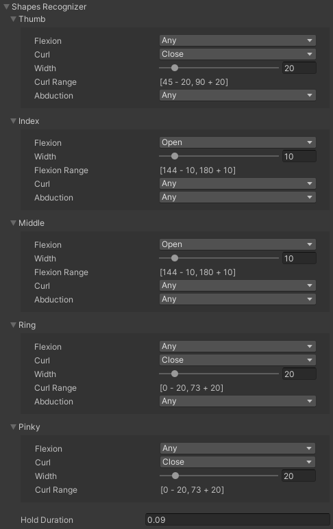

5. 在 **Transform Recognizer**，手的设置如下：
     
    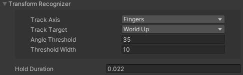

6. 使用 **YVR Hand Pose** 脚本设置手势事件。选择 **Track Type** 和 **Config**。添加 **Hand Pose Start**，**Hand Pose Update** 和 **Hand Pose End** 事件触发的函数。 

7. 保存项目。 

### 创建 Fist 手势

1. 在项目中，选择 `Create Empty`，在 Hierarchy 面板下添加一个新的游戏对象，并将其重命名为 **FistPose**。

2. 在 Inspector 面板下，选择 `Add Component` 添加 **YVR Hand Pose** (YVRHandPose.cs) 和 **YVR Hand Pose Generator** (YVRHandPoseGenerator.cs) 脚本。

3. 在 **YVR Hand Pose Generator** 下，选择 **New** 创建一个新的手部姿势配置文件。将其命名为 “**Fist**”。

4. 在 **Shapes Recognizer**，手指的设置如下：
     
    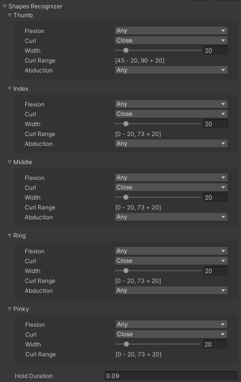

5. 在 **Transform Recognizer**，手的设置如下：
     
    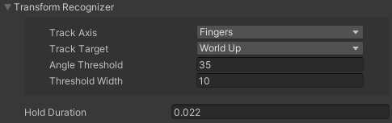

6. 使用 **YVR Hand Pose** 脚本设置手势事件。选择 **Track Type** 和 **Config**。添加 **Hand Pose Start**，**Hand Pose Update** 和 **Hand Pose End** 事件触发的函数。 

7. 保存项目。 