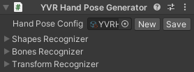
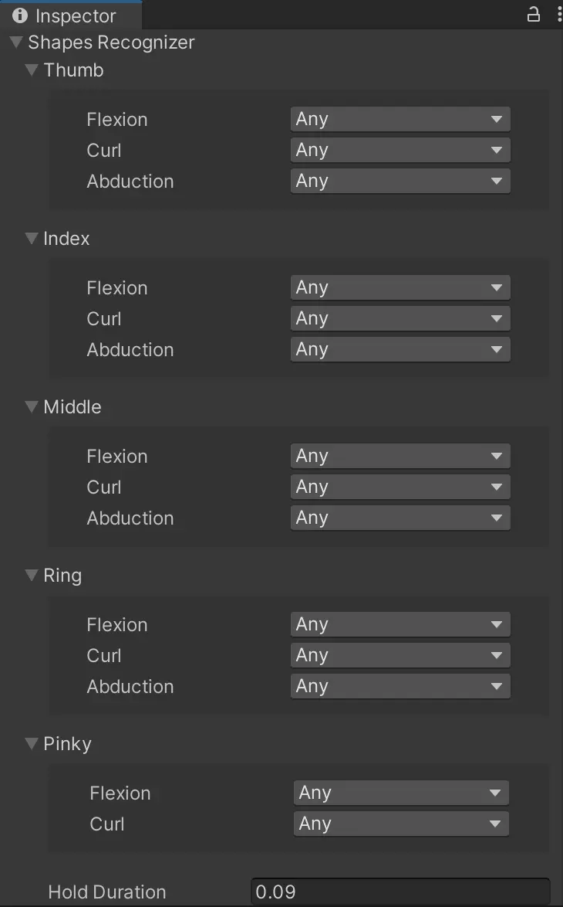
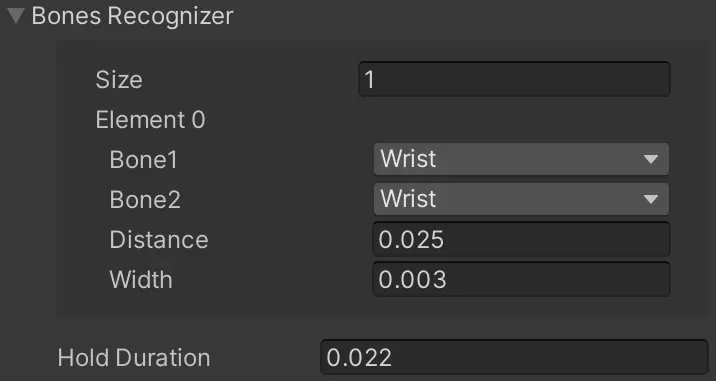
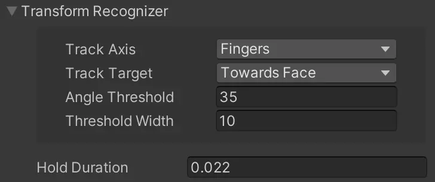

# YVR Hand Pose Generator

YVR 手势生成脚本包含： 
- 手势配置文件（Hand Pose Config）
- 手指姿态组件（Shapes Recognizer）
- 手部关节组件（Bones Recognizer）
- 朝向设置组件（Transform Recognizer）

手势配置（Hand Pose Config）文件含有手指姿态，关节点和朝向设置。
     
    

## Shapes Recognizer

手指姿态组件（Shapes Recognizer）用于定义手指形状，包括弯曲、卷曲和外展。手指形状有不同的状态，如下： 

- Any（任意）：表示手指姿态可以处于任何状态，不会影响手势的识别。
- Open（张开）： 用于设置手指伸直或张开的程度。
- Close（闭合）：用于设置手指弯曲或闭合的程度。
- Custom（自定义）：用于自定义手指的屈曲或弯曲程度。

宽度（Width）用于设置手指姿态的有效范围。将手部姿态的状态设置为 Open、Close 和 Custom 时，你可以为各个姿态配置宽度。在两种状态之间转换时，由于用户手指姿态和算法捕捉的误差，可能会导致数据抖动。当用户的手指形状接近状态之间的临界点时，过渡期间可能会出现意外抖动。因此，设置每个手指姿态的宽度（也称为阈值宽度）使切换更加稳定，从而改善这个问题。
     
    

## Bones Recognizer

手部关节组件（Bones Recognizer）用于定义手部关节点之间的接触关系。当无法单独通过手指姿态组件来定义手势时，可以联合手部关节点之间的关系来进行定义，例如使大拇指指尖和食指指尖接触，协助实现 “Ok” 手势。
     
    

## Transform Recognizer

朝向设置组件组件用于定义手的方向。配置项有追踪轴（Track Axis）、追踪目标（Track Target）、角度阈值（Angle Threshold）以及阈值宽度（Threshold Width）。
     
    

追踪轴（Track Axis）用于定义手势追踪的参考轴。
- Fingers（手指）：X 轴，四指相对手腕方向。
- Palm（手掌）：Y 轴，掌心所朝方向。
- Thumb（拇指）：Z 轴，拇指相对手腕方向。

追踪目标（Track Target）用于定义手部的朝向。
- Towards Face（面向脸部）： 手部朝向脸部。
- Away From Face（远离面部）：手部背离面部。
- World Up（世界向上）：手部朝向上方。
- World Down（世界向下）：手部朝向下方。

当手部角度位于 [(Angle Threshold - Threshold Width/2), (Angle Threshold + Threshold Width/2)] 区间内时，手部朝向有效，否则无效。