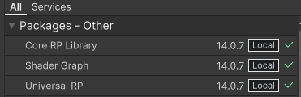
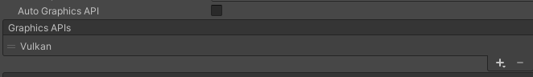
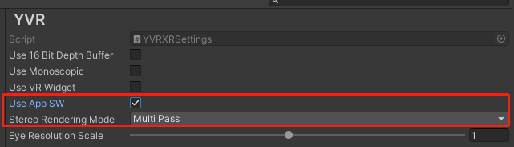
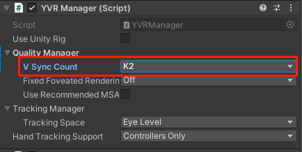

# Application SpaceWarp

Application SpaceWarp (AppSW) is an optimization technique for developers that allows applications to render at half the actual display refresh rate, freeing up additional computing power for appropriate content. In testing, AppSW has been shown to provide up to 70% more computing power to applications with virtually no perceptible flaws. When developers turn on AppSW during the development and design phase, the system will extrapolate and re-project frames based on the motion vector and depth information of the original data in the application, and automatically synthesise one frame of the original rendered image into multiple new frames to reduce the original output frame rate of the device, lower the load and power consumption of the device, and ultimately break through the arithmetic limitations to achieve a more lifelike and better picture performance on YVR devices, which is close to that of PCVR. YVR devices can achieve more realistic and better image performance.


## Environment Requirements

- Device: YVR1 or YVR2

- SDK Version: 2.4.0 and above

- System Version: 1.2.5.x 


## Enable AppSW

Refer to the following steps to enable AppSW feature. 

1. Clone the [Unity-Graphics](https://github.com/YVRDeveloper/Unity-Graphics) repository. Import the three package.json files. From the menu bar, select **Window** > **Pacakge Manager** > **Add package from disk...** and install the following packages:
    - Core RP Library 
    - Shader Graph
    - Universal RP
    <br />
        


2. If custom shader is used, you will need to add `Motion Vector Pass` to the shader of the AppSW object. 

    

    > [!Note] 
    > - There is no need to modify the shader if Lit or SimpleLit is used. 
    > - Transparent ojects do not need to add `Motion Vector Pass`, only opaque objects requires to add it.
    > - Objects close to opaque (e.g. Alpha close to 1) can be added according to situation. 

3. From the menu bar, select **Edit** > **Project Settings**. From the left panel, select **Player** > **Android settings** > **Other Settings**. Under **Rendering** section, add **Vulkan** to **Graphics APIs**.
    <br />
    

4. From the menu bar, select **Edit** > **Project Settings**. From the left panel, select **XR Plug-in Management** > **YVR**, set the following settings:
    <br />
    - Check **Use AppSW**
    - Select **Multiview** as **Stereo Rendering Mode**
    <br />
    

5. Enter the following code to enable AppSW.

    ```
    YVRManager.instance.SetAppSWEnable(true);
    ```

6. Assuming your app frame rate is currently at 90fps, when AppSW is turned on, the app will render at 45fps, but achieving at 90fps. If you would like to compare the rendering effect of `AppSW On + 45fps` and `AppSW Off + 45fps`, under **YVR Manager** script, select **Quality Manager** > **V Sync Count: K2**.
    <br />
    


## Known Issues

When using the AppSW feature, your app may experience some rendering issues. Please refer to the following scenarios and instructions to resolve the issues:

- If the background within the scene is very clean and contains elements such as straight lines, grids, etc., AppSW may cause image distortion, e.g., distorted straight lines. If the image is distorted, keep debugging and adjusting the background until a satisfactory result is achieved. 
<br /><br />

- If the scene contains some high-speed rotating objects, distortion artefacts may appear around the objects when AppSW is turned on, which can be solved by reducing the rotation speed of the objects.
<br /><br />

- If there are unexpected pauses in individual elements of the scene or ripples on the screen, this is generally due to inaccurate data in the motion vectors for the following reasons:

   - If the motion vector buffer does not show the motion of a moving part of the scene, this can cause stutters because moving objects seem to stay in place in the composite frame.

   - If the motion vector buffer shows motion in the motionless parts of the scene, ripples are created because stationary objects move in the composite frame.