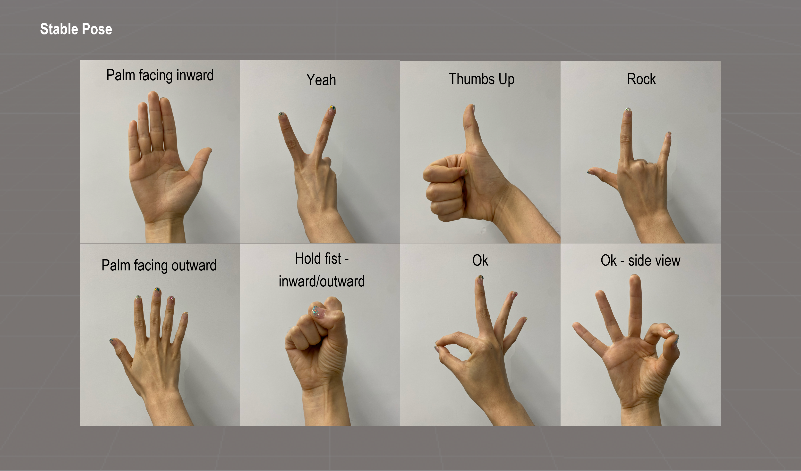
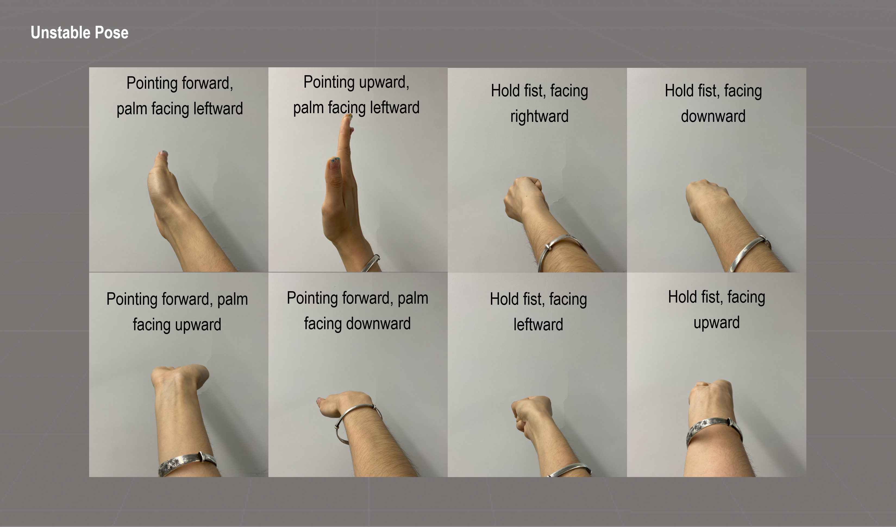
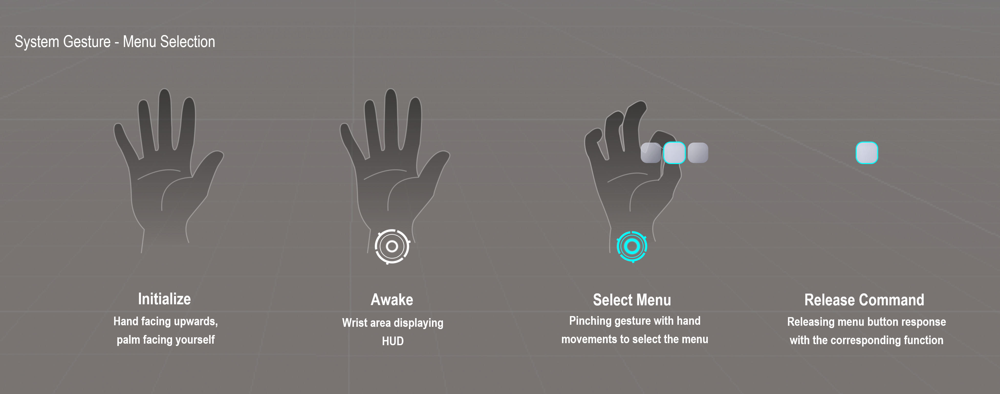

# Hand Gesture Limitation

This document puts some constraints on the boundaries of application in gesture recognition to avoid some common recognition errors. It is divided into three parts:

- Part I: Static gestures, it ontains the recommended gestures and non-recommended gestures;
- Part II: Dynamic gestures, it describes the different hand movements;
- Part III: YVR system gestures, it is recommended that third-party applications avoid to use gestures that are similar to system gestures, not to be mistakenly triggered in the application.

## Static Gestures

It is recommended to use a hand pose that can be done naturally and comfortably by the user, which is more ergonomic, and is also recommended at the level of gesture recognition:

- Hand pose with more **visible features** of the hand, i.e. hand pose where more hand features can be seen.
- It is recommended to use the **right hand**.
- Refer to the following image for illustration:

      
    

 
Various twisted, chirpy, anti-human gestures are not recommended, as well as not recommended at the algorithmic level:

- Hand poses with fewer **visible hand features**, i.e. hand poses where more hand features cannot be seen.
- Hand poses with **overlapping hands**, such as crossed arms, are not recommended.
- Refer to the follow image for illustration (similar **hand poses (left/right) are also not recommended**):

      
    

## Dynamic Gestures

Dynamic gestures can be understood as: static hand pose + time-keeping judgment. Therefore in combination with the recommendations for the use of static hand shapes, gestures with rapid movements are not recommended:

- Rapidly **waving** various hand poses, e.g. rapidly waving of palms, fists, etc.
- Rapidly **turning** various hand poses, e.g., rapidly rotating of the wrist, etc.
- Rapidly executing of **dynamic gestures**, e.g. rapid fist clenching, rapid pinching, etc.
- Rapid **movement** of various hand shapes, e.g. rapid movement of various hand poes in various directions

## System Gestures

It is recommended to avoid using system gestures for app interactions. This prevents triggering the system menu by mistake. The current system includes the following system gestures:

- Initialize: Hand facing upwards, palm facing yourself
- Awake: Wrist area displaying system icon - Systen is awake
- Select Menu: Pinching gesture with hand movements to select the menu
- Release command: Hovering over the button, separates the index finger and thumb, the secondary menu fades out and only the function button is displayed (flashes for a certain amount of time and then disappears), and responds to its corresponding function.

