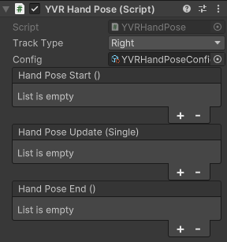

# YVR Hand Pose

YVR Hand Pose script is used to set up hand pose events. You can use it to select which hand to be tracked ("Track Type"), add the hand pose configuration file generated by the YVR Hand Pose Generator script, and create events to be triggered by the hand pose. 

Track Type is used to define the hand to be tracked:
- Any: To track any hand detected by the device.
- Left: To track the left hand.
- Right: To track the right hand.

Config is used to store the hand pose configuration file generated by YVR Hand Pose Generator.

Hand pose event contains: 
- Start: This event is triggered when the hand pose starts.
- Update: The event is triggered at every frame during the hand pose and provides the duration of the pose in milliseconds.
- End: This event is triggered when the hand pose ends.
     
    