# Hand Pose Demo

In the following sections, it demonstrates the pose creation steps using hand pose generator and hand pose event trigger. There are vairous poses listed. The thumb-up pose is having the thumb pointing upwards and the other fingers are in the shape of flexion and curl. The ok pose has the thumb and index fingers curling and pinching at the finger tips. The middle, ring and little fingers are not fully extended or opened. Refer to the following sample poses: 

- Thumb-up 
- Ok 
- Rock 
- Gun 
- Love 
- Peace
- Fist 

## Import SDK 

1. Download the latest version of [YVR Unity SDK](https://developer.yvr.cn/#/). 

    > [!Important]
    > SDK version has to be 2.4.x and above. 

2. Unzip the downloaded package.

3. Open the project in which the packages will be imported. 

4. From the menu bar, select **Windows** > **Package Manager**.

5. In the **Pacakge Manager** window, select **+** > **Add package from disk...**.

    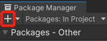

6. Enter the path of the unzipped SDK and import the package.json files in this order: `Utilities` > `Core` > `Interaction Toolkit`.

7. After importing the packages, YVR SDK Setting window will be shown. 

8. In the **Package Manager** window, select **Packages: In Project** > **YVR Interaction Toolkit** > **Samples**, select **Import** to import Hands Interaction Demo.

    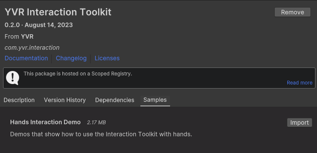

## Create Hand Pose

### Create Thumb-up Pose 

1. In your project, select `Create Empty` to add a new game object under the Hierarchy panel and rename it as "**ThumbUpPose**".

2. Under the Inspector panel, select `Add Component` to add **YVR Hand Pose** (YVRHandPose.cs) and **YVR Hand Pose Generator** (YVRHandPoseGenerator.cs) scripts.

3. Under **YVR Hand Pose Generator**, select **New** to create a new hand pose configuration file. Renmae it as "**ThumbUp**".

4. Under **Shapes Recognizer**, edit the settings of the fingers as the following: 
     
    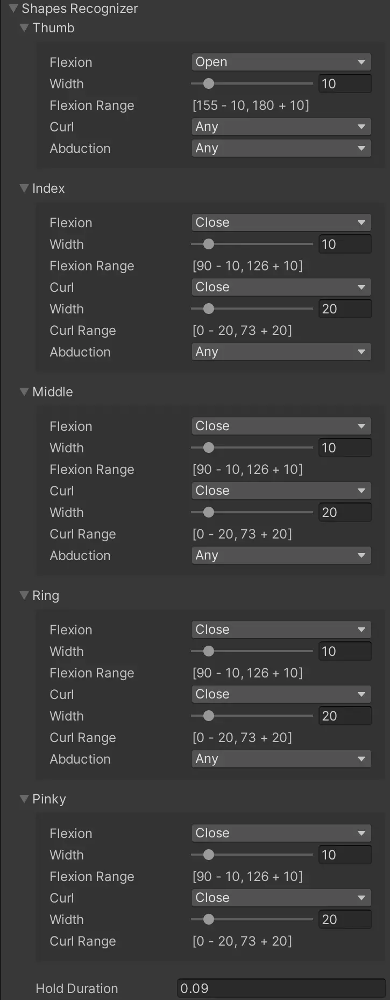

5. Under **Transform Recognizer**, edit the settings of the hand as the following:
     
    

6. Use **YVR Hand Pose** script to set up hand pose events. Select **Track Type** and **Config**. Add functions to **Hand Pose Start**, **Hand Pose Update** and **Hand Pose End**. 

7. Save the project. 

### Create Ok Pose

1. In your project, select `Create Empty` to add a new game object under the Hierarchy panel and rename it as "**OkPose**".

2. Under the Inspector panel, select `Add Component` to add **YVR Hand Pose** (YVRHandPose.cs) and **YVR Hand Pose Generator** (YVRHandPoseGenerator.cs) scripts.

3. Under **YVR Hand Pose Generator**, select **New** to create a new hand pose configuration file. Renmae it as "**Ok**".

4. Under **Shapes Recognizer**, edit the settings of the fingers as the following: 
     
    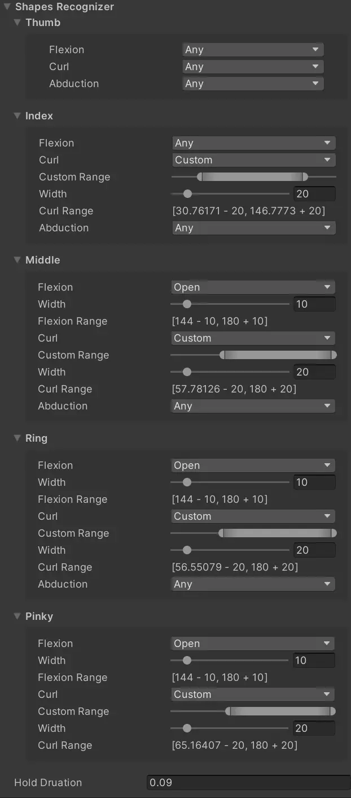

5. Under **Bones Recognizer**, edit the settings of the fingers as the following: 
     
    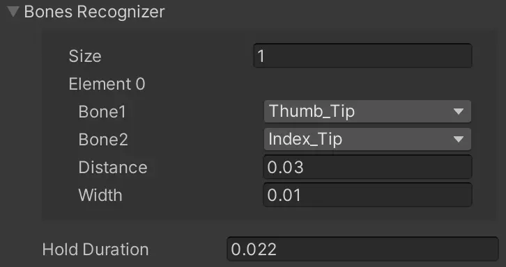

6. Under **Transform Recognizer**, edit the settings of the hand as the following:
     
    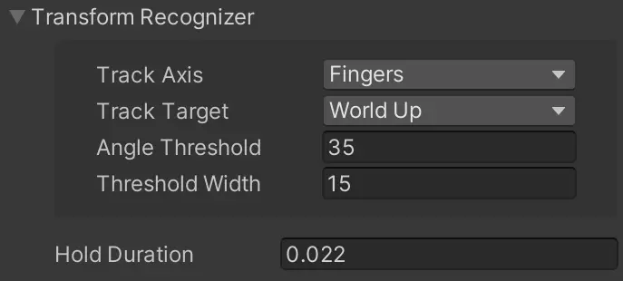

7. Use **YVR Hand Pose** script to set up hand pose events. Select **Track Type** and **Config**. Add functions to **Hand Pose Start**, **Hand Pose Update** and **Hand Pose End**. 

8. Save the project.

### Create Rock Pose 

1. In your project, select `Create Empty` to add a new game object under the Hierarchy panel and rename it as "**RockPose**".

2. Under the Inspector panel, select `Add Component` to add **YVR Hand Pose** (YVRHandPose.cs) and **YVR Hand Pose Generator** (YVRHandPoseGenerator.cs) scripts.

3. Under **YVR Hand Pose Generator**, select **New** to create a new hand pose configuration file. Renmae it as "**Rock**".

4. Under **Shapes Recognizer**, edit the settings of the fingers as the following: 
     
    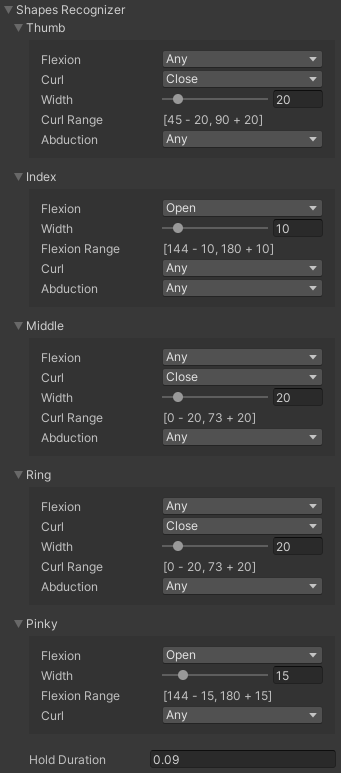

5. Under **Transform Recognizer**, edit the settings of the hand as the following:
     
    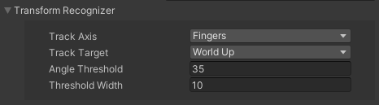

6. Use **YVR Hand Pose** script to set up hand pose events. Select **Track Type** and **Config**. Add functions to **Hand Pose Start**, **Hand Pose Update** and **Hand Pose End**. 

7. Save the project. 

### Create Gun Pose

1. In your project, select `Create Empty` to add a new game object under the Hierarchy panel and rename it as "**GunPose**".

2. Under the Inspector panel, select `Add Component` to add **YVR Hand Pose** (YVRHandPose.cs) and **YVR Hand Pose Generator** (YVRHandPoseGenerator.cs) scripts.

3. Under **YVR Hand Pose Generator**, select **New** to create a new hand pose configuration file. Renmae it as "**Gun**".

4. Under **Shapes Recognizer**, edit the settings of the fingers as the following: 
     
    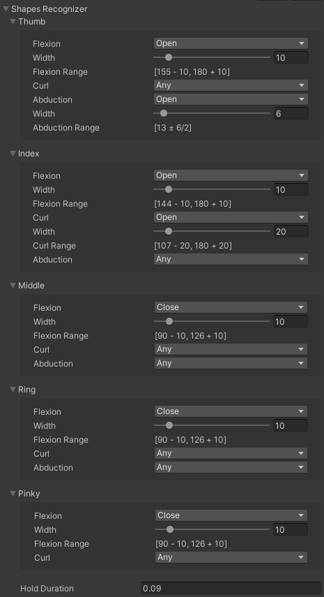

5. Under **Transform Recognizer**, edit the settings of the hand as the following:
     
    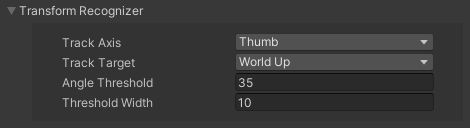

6. Use **YVR Hand Pose** script to set up hand pose events. Select **Track Type** and **Config**. Add functions to **Hand Pose Start**, **Hand Pose Update** and **Hand Pose End**. 

7. Save the project. 

### Create Love Pose

1. In your project, select `Create Empty` to add a new game object under the Hierarchy panel and rename it as "**LovePose**".

2. Under the Inspector panel, select `Add Component` to add **YVR Hand Pose** (YVRHandPose.cs) and **YVR Hand Pose Generator** (YVRHandPoseGenerator.cs) scripts.

3. Under **YVR Hand Pose Generator**, select **New** to create a new hand pose configuration file. Renmae it as "**Love**".

4. Under **Shapes Recognizer**, edit the settings of the fingers as the following: 
     
    

5. Under **Transform Recognizer**, edit the settings of the hand as the following:
     
    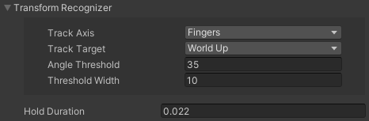

6. Use **YVR Hand Pose** script to set up hand pose events. Select **Track Type** and **Config**. Add functions to **Hand Pose Start**, **Hand Pose Update** and **Hand Pose End**. 

7. Save the project. 

### Create Peace Pose

1. In your project, select `Create Empty` to add a new game object under the Hierarchy panel and rename it as "**PeacePose**".

2. Under the Inspector panel, select `Add Component` to add **YVR Hand Pose** (YVRHandPose.cs) and **YVR Hand Pose Generator** (YVRHandPoseGenerator.cs) scripts.

3. Under **YVR Hand Pose Generator**, select **New** to create a new hand pose configuration file. Renmae it as "**Peace**".

4. Under **Shapes Recognizer**, edit the settings of the fingers as the following: 
     
    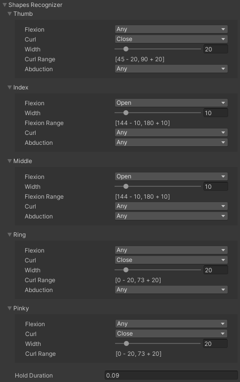

5. Under **Transform Recognizer**, edit the settings of the hand as the following:
     
    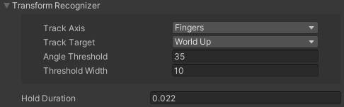

6. Use **YVR Hand Pose** script to set up hand pose events. Select **Track Type** and **Config**. Add functions to **Hand Pose Start**, **Hand Pose Update** and **Hand Pose End**. 

7. Save the project. 

### Create Fist Pose

1. In your project, select `Create Empty` to add a new game object under the Hierarchy panel and rename it as "**FistPose**".

2. Under the Inspector panel, select `Add Component` to add **YVR Hand Pose** (YVRHandPose.cs) and **YVR Hand Pose Generator** (YVRHandPoseGenerator.cs) scripts.

3. Under **YVR Hand Pose Generator**, select **New** to create a new hand pose configuration file. Renmae it as "**Fist**".

4. Under **Shapes Recognizer**, edit the settings of the fingers as the following: 
     
    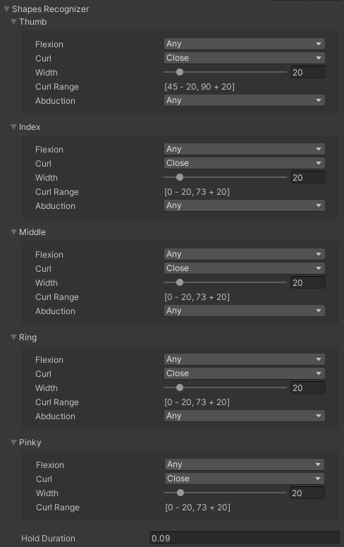

5. Under **Transform Recognizer**, edit the settings of the hand as the following:
     
    

6. Use **YVR Hand Pose** script to set up hand pose events. Select **Track Type** and **Config**. Add functions to **Hand Pose Start**, **Hand Pose Update** and **Hand Pose End**. 

7. Save the project. 