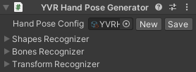
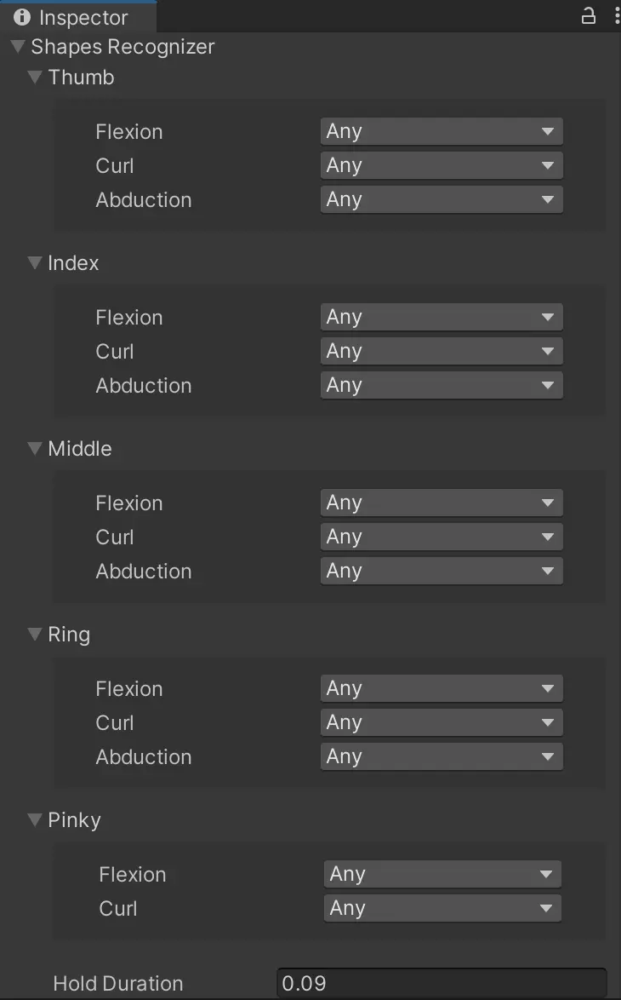
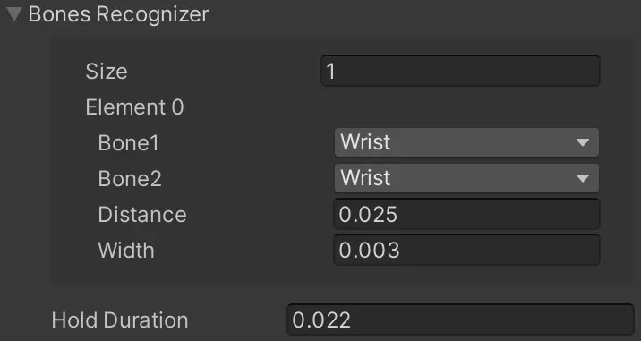
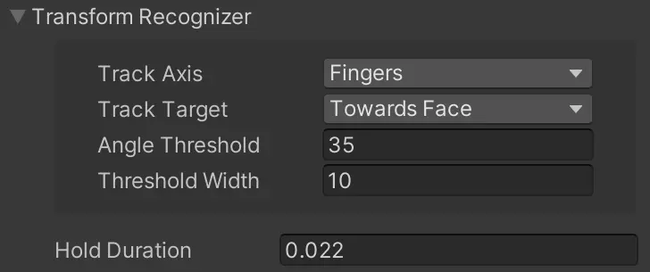

# YVR Hand Pose Generator

YVR Hand Pose Generator scripts contains: 
- Hand Pose Config 
- Shapes Recognizer
- Bones Recognizer
- Transform Recognizer

Hand Pose Config file includes the shape, bone and transform settings. 
     
    

## Shapes Recognizer

The Shapes Recognizer is used to define finger shapes, which include flexion, curl and abduction. Finger shapes have different states, these include: 

- Any: The finger shape can be in any state, which will not affect hand pose recognition.
- Open: Use to set the degree at which a finger extends or opens.
- Close: Use to set the degree at which the finger curls or closes.
- Custom: Use to customize the degree of extension/curl for fingers.

Width is used to calculate a range within which a shape is valid and recognized. You can set a "Width" for a finger shape after setting the shape's state to "Open", "Close", or "Custom". When transitioning between two states, data jitter may occur due to errors in both the user's finger shape and the algorithm's recognition capability. This is specific to the user's finger shape approaches the critical point between the states, unexpected jitter may occur during the transition. Hence, setting the width (also known as threshold width) for each finger shape to make the transition smoother helps to resolve this issue. 
     
    

## Bones Recognizer

The Bones Recognizer is used to define inter-joint relations, e.g., the distance between two hand joints. When it is not possible to define a hand pose using the Shapes Recognizer, you could use the Bones Recognizer together, such as the thumb and index finger tips connection (pinch) facilitating to create the "ok" pose.
     
    

## Transform Recognizer

You can use the Transform Recognizer to define the orientation of hands by setting the "Track Axis", "Track Target", "Angle Threshold", and "Threshold Width". 
     
    

Track Axis is used to define the axis reference for hand tracking.
- Fingers: the X axis, four fingers pointing towards the orientation of the wrist.
- Palm: the Y axis, the orientation that the palm is facing.
- Thumb: the Z axis, the orientation of the thumb relative to the wrist.

Track Target is used to define the orientation of the hand.
- Towards Face: The hand faces towards the face.
- Away From Face: The hand faces away from the face. 
- World Up: The hand faces upwards. 
- World Down: The hand faces downwards.

When the hand's angle is within [(Angle Threshold - Threshold Width/2), (Angle Threshold + Threshold Width/2)], the hand's orientation you set is valid; otherwise, the orientation is invalid.