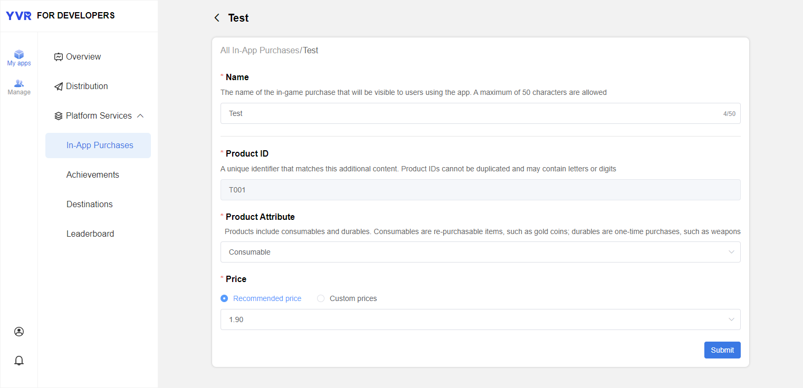
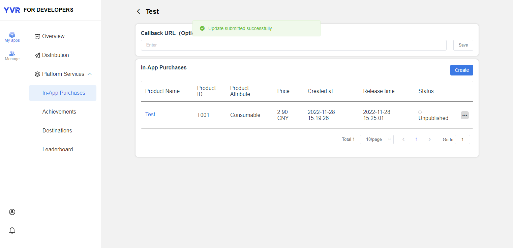

# In-App Purchase

> [!Important]
> Before using any platform features, developers have to initialize Platform SDK first. Refer to [Platform](./Platform.md) for more information.

YVR Payment is a current payment system based on YVR account system. The payment settlement is done by YVR's game currency (Y coin). Users will need to enter YVR user centre to top-up their account.


## Add Product

1. Login to [Management Center](https://developer.yvr.cn/yvrdev/all_apps). 

2. Click on the app that you have created, select **My apps > Platform Services > In-App Purchases**. Click Create to add new product. 

3. Fill the product information: 

    - **Name**: Product name that is displayed to the users.

    - **Product ID**: Unique ID of each product. 

    - **Product Attribute**: Consumable or durable.

    - **Price**: Recommended or custom. 

    

4. Click Submit.

    

- Status: Unpublished / Published / Removed from sale


## API Information

### Login 

Before proceeding to payment, check the user login status.

```csharp
YVR.Platform.LoginPay.Initialize(<appID>);

if (LoginPay.IsYVRUserLogin)
    Debug.Log("User has logged in.");
else
    Debug.LogError("User has not logged in!");

```

### Payment

`YVR.Platform.PayResponse`: Get the details of payment 

### Order

`YVR.Platform.OrderListResponse`: Get the order details, e.g. SKU, price, quantity and etc. 