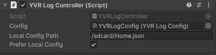
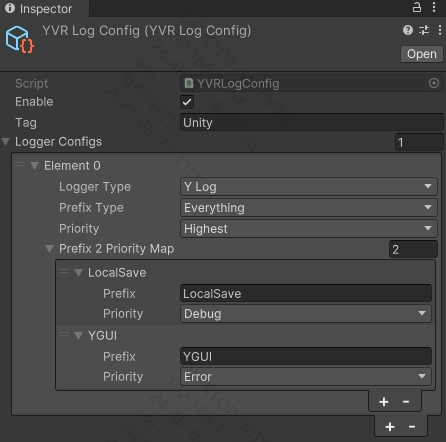

# YVRLogController

YVRLogController Inspector 面板如下所示：



其中 `Config` 字段配置 [YVRLogConfig](xref:YVR.Utilities.YVRLogConfig) 所定义 ScriptableObject 的路径，`Local Config Path` 字段配置本地 Json 文件的路径，该 Json 中的数据应当是 [YVRLogConfig](xref:YVR.Utilities.YVRLogConfig) 的序列化结果。`Prefix Local Config` 字段配置是否在本地 Json 文件合法的情况下，优先使用本地 Json 文件中的配置。

## YVRLogConfig

[YVRLogConfig](xref:YVR.Utilities.YVRLogConfig) 的配置示例如下所示：



其中 `Enable` 字段对应 [YVRLog.enable](xref:YVR.Utilities.YVRLog.enable)，`Tag` 字段将调用 [YLogLogger.ConfigureYLog](<xref:YVR.Utilities.YLogLogger.ConfigureYLog(System.String,System.Int32)>) 配置，其最终会影响 Android Logcat 中的 Tag。

> [!Warning]
>
> `Tag` 字段在 LoggerType 为 Unity 的情况下，将不生效

`PrefixType` 和 `LoggerType` 会分别决定使用的 [Logger](./Logger.md) 和 [LogPrefix](./LogPrefix.md) 类型。

`Priority` 和 `Prefix2PriorityMap` 字段将共同决定使用的 [LoggerController](./LoggerController.md) 类型。只要 `Priority` 不为 `Lowest`，则会使用 [LoggerPriorityController](xref:YVR.Utilities.LoggerPriorityController) 类型，只要 `Prefix2PriorityMap` 不为空，则会使用 [LoggerPrefixPriorityController](xref:YVR.Utilities.LoggerPrefixPriorityController) 类型。

> [!Note]
>
> `Priority` 决定了一个 Logger 的全局过滤等级，`Prefix2PriorityMap` 决定了一个 Logger 中对于细分前缀的过滤等级。

## Local Json

一个典型的本地配置 Json 如下，该文件即为 [YVRLogConfig](xref:YVR.Utilities.YVRLogConfig) 序列化的直接产物：

```json
{
    "enable": true,
    "tag": "Unity",
    "loggerConfigs": [
        {
            "loggerType": 1,
            "prefixType": 2,
            "priority": 4,
            "prefix2PriorityMap": [
                {
                    "prefix": "LocalSave",
                    "priority": 0
                }
            ]
        }
    ],
    "name": "LocalConfig",
    "hideFlags": 0
}
```
